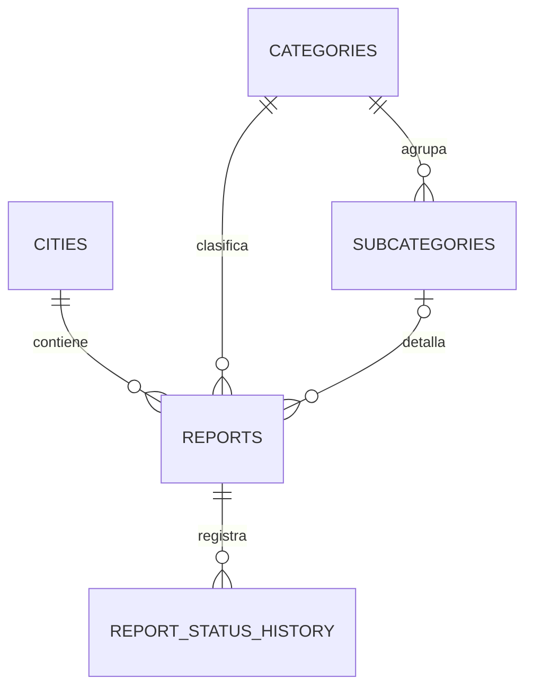

# Fase 1A — Inventario reproducible y diseño de base de datos

**Estado:** diseño local; no aplicado a Supabase  
**Alcance:** inventario de solo lectura y definición arquitectónica previa a migraciones

## Objetivo

Obtener evidencia reproducible del esquema Supabase actual y fijar el modelo objetivo de Fase 1 antes de redactar migraciones definitivas. Esta etapa no modifica esquema, datos, permisos, RLS ni configuración remota.

## Decisión arquitectónica sobre categorías y ciudades

`categories` y `subcategories` son catálogos generales compartidos. No reciben `city_id` y no se duplican por ciudad.

La relación inicial con ciudad se incorpora en `reports.city_id`. Esto permite que cada reporte pertenezca a una ciudad sin fragmentar la taxonomía común.

La activación, orden, visibilidad o personalización de categorías por ciudad se resolverá posteriormente mediante una tabla `city_category_settings`. Esa tabla no forma parte de Fase 1A y no debe crearse todavía.

Consecuencias:

- una categoría puede utilizarse en múltiples ciudades;
- una subcategoría pertenece a una categoría global;
- la integridad categoría–subcategoría no depende de la ciudad;
- cada reporte debe pertenecer a una ciudad;
- las políticas futuras podrán combinar catálogos generales con configuración local sin duplicar IDs.

## Modelo objetivo mínimo

### `cities`

Representa las ciudades soportadas por la plataforma.

Campos previstos:

- `id`: UUID interno;
- `name`: nombre visible;
- `slug`: identificador estable y único;
- `province`: provincia o jurisdicción;
- `country_code`: código de país;
- `is_active`: disponibilidad operativa;
- `created_at`;
- `updated_at`.

### `categories`

Catálogo general. Debe conservar los IDs actuales y su estructura comprobada mediante inventario. No incorpora `city_id`.

### `subcategories`

Catálogo general dependiente de `categories`. Debe conservar los IDs actuales. No incorpora `city_id`.

La relación `subcategories.category_id → categories.id` será obligatoria para nuevos datos una vez que el inventario confirme compatibilidad.

### `reports`

Campos objetivo:

- `id`;
- `tracking_code`;
- `city_id`;
- `category_id`;
- `subcategory_id` opcional;
- `description`;
- `latitude`;
- `longitude`;
- `address_text`;
- `occurred_at`;
- `urgency`;
- `moderation_status`;
- `workflow_status`;
- `created_at`;
- `updated_at`.

Durante la transición se conservarán las columnas heredadas `address` y `status`. No se propone renombrarlas, cambiar su tipo ni eliminarlas en Fase 1.

### `report_status_history`

Registra cambios de moderación y seguimiento operativo sin mezclar ambos conceptos.

Campos previstos:

- `id`;
- `report_id`;
- estado de moderación anterior y nuevo;
- estado operativo anterior y nuevo;
- `changed_by` opcional;
- nota operativa opcional;
- `created_at`.

No tendrá acceso público directo.

## Relaciones e integridad

Reglas previstas:

- `reports.city_id → cities.id`;
- `reports.category_id → categories.id`;
- `reports.subcategory_id → subcategories.id`;
- `(reports.subcategory_id, reports.category_id)` debe coincidir con una subcategoría de esa categoría;
- latitud entre `-90` y `90`;
- longitud entre `-180` y `180`;
- `urgency`: `low`, `medium` o `high`;
- `tracking_code` único, público y no secuencial;
- moderación y flujo operativo con valores controlados separados;
- `updated_at` mantenido por trigger.

Los valores definitivos de estados se cerrarán después de inventariar los valores actuales y documentar su mapeo sin pérdida semántica.

## Inventario autorizado

El archivo `supabase/inventory/phase_1_read_only_inventory.sql` contiene únicamente consultas de lectura. Su salida permite conocer:

- columnas, tipos, nulabilidad y defaults;
- claves primarias y foráneas;
- restricciones `CHECK` y `UNIQUE`;
- índices;
- triggers y funciones relacionadas;
- grants;
- políticas y estado de RLS;
- cantidades de filas;
- distribución agregada de urgencias y estados;
- conteos de nulabilidad, coordenadas inválidas y relaciones huérfanas;
- cantidad de grupos de nombres duplicados.

El inventario no selecciona descripciones, direcciones, coordenadas, UUID de reportes ni otros datos de filas individuales.

## Procedimiento de ejecución futura

1. Obtener aprobación explícita para consultar el entorno objetivo.
2. Ejecutar el archivo manualmente con un rol autorizado de solo lectura.
3. No modificar el script dentro del editor remoto.
4. Guardar la salida fuera del repositorio hasta revisarla.
5. Eliminar o anonimizar metadatos internos innecesarios antes de compartirla.
6. Comparar la salida con el frontend y la auditoría.
7. Resolver inconsistencias y decisiones de mapeo.
8. Recién entonces redactar migraciones definitivas para revisión.

## Condiciones para pasar a Fase 1B

- inventario completo obtenido y revisado;
- confirmación de que los registros actuales pertenecen a Posadas o clasificación alternativa documentada;
- valores reales de `status` y `urgency` inventariados;
- orfandad y coordenadas inválidas cuantificadas;
- DDL actual reproducible;
- estrategia de backfill aprobada;
- SQL completo mostrado antes de cualquier aplicación remota;
- respaldo y reversión documentados.

## Fuera de alcance

- ejecutar el inventario;
- crear migraciones definitivas;
- crear `city_category_settings`;
- modificar datos actuales;
- cambiar grants o políticas RLS;
- aplicar SQL remoto;
- utilizar claves administrativas en el frontend;
- publicar en producción.
