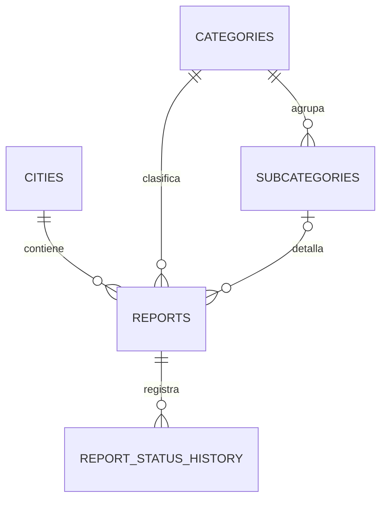

# Fase 1B — Base de datos versionada

**Estado:** finalizada en `main`; base de Fase 2

**Proyecto remoto protegido:** `xouoxuoueutukemaqjro`

**Aplicación remota:** no autorizada

## Validación de staging

La validación completa se realizó el 5 de agosto de 2026 exclusivamente en el
staging autorizado `ftpnmjshhzowbmdgbpkr`, utilizando el commit SQL
`fd0fe336601265cb2538ac04b757a6bde6c1f2f7`. La baseline, las siete
migraciones, el seed y la suite SQL fueron aprobados.

La producción protegida `xouoxuoueutukemaqjro` no fue accedida ni modificada.
La Fase 2, con validación de servidor, rate limiting y controles antiabuso,
continúa siendo obligatoria antes de cualquier aplicación en producción.

El prototipo ejecutable heredado `posadas_reporta.html` fue retirado del árbol
actual. Continúa disponible únicamente en el historial Git y no forma parte de
la aplicación Vite ni del despliegue actual.

## Objetivo

Versionar el esquema confirmado en Fase 1A y preparar el modelo para
multi-ciudad, seguimiento, moderación y operación sin eliminar ni renombrar
objetos existentes. La implementación conserva el reporte heredado y mantiene
compatibilidad temporal con el frontend del MVP.

## Modelo



`categories` y `subcategories` son catálogos globales. `city_id` existe
únicamente en `reports`. `city_category_settings` no forma parte de esta fase.

## Archivos y orden

1. `supabase/baseline/00000000000000_current_schema.sql`: reconstrucción del
   esquema inventariado para una base vacía.
2. `20260805010100_create_cities.sql`: ciudad y seed estable de Posadas.
3. `20260805010200_add_report_growth_columns.sql`: columnas inicialmente
   anulables y bloqueo temporal de inserciones públicas.
4. `20260805010300_backfill_existing_reports.sql`: backfill preservando datos.
5. `20260805010400_add_report_integrity_indexes_and_triggers.sql`: integridad,
   índices, funciones y triggers.
6. `20260805010500_create_report_status_history.sql`: historial sin acceso
   público.
7. `20260805010600_harden_grants_and_rls.sql`: RLS y mínimo privilegio.
8. `20260805010700_seed_global_categories.sql`: catálogo global verificable.
9. `supabase/tests/phase_1b_database.sql`: pruebas transaccionales locales.

## Baseline y upgrade

La baseline está fuera de `supabase/migrations` y comienza con una advertencia
que identifica el proyecto remoto protegido. Reproduce el esquema lógico,
políticas y grants inventariados, pero no contiene datos.

Rutas deliberadamente separadas:

```text
Base vacía local:
baseline → migraciones de estructura/hardening → seed → tests

Base existente:
backup → migraciones ordenadas, incluido el seed idempotente → tests
```

No existe un script ni comando que pueda aplicar ambas rutas.

## Ventana de mantenimiento y estado intermedio seguro

La aplicación sobre una base existente requiere una ventana de mantenimiento
y un backup verificado antes de comenzar. `20260805010200` revoca `INSERT`
sobre `public.reports` a `anon` y `authenticated` antes de alterar la tabla.
Las inserciones públicas permanecen bloqueadas desde `010200` hasta que
`010600` restaura únicamente el `INSERT` por columnas aprobado.

Si una migración intermedia falla, la base queda en un estado seguro sin nuevas
inserciones públicas. La recuperación consiste en corregir el fallo y continuar
la cadena ordenada de migraciones; no se deben restaurar los privilegios amplios
anteriores para reabrir el flujo anticipadamente. Las pruebas SQL verifican el
estado final y no simulan esta ventana intermedia.

## Tracking code

Formato: `PR-` más 20 caracteres hexadecimales mayúsculos.

- Entropía: 80 bits.
- Fuente: `extensions.gen_random_bytes(10)`, provista por `pgcrypto`.
- Codificación: `pg_catalog.encode` y `pg_catalog.upper`.
- Verificación previa mediante
  `pg_catalog.to_regprocedure('extensions.gen_random_bytes(integer)')`.
- El primer preflight se ejecuta al inicio de `010100`, antes de crear o alterar
  objetos. `010400` conserva su comprobación posterior como defensa adicional.
- Las migraciones no instalan, mueven ni modifican `pgcrypto`.
- Máximo de ocho intentos.
- Advisory transaction lock calculado por candidato.
- Constraint `UNIQUE` como garantía definitiva.
- Los códigos no nulos se conservan en restauraciones o migraciones.

La función de tracking es `SECURITY DEFINER` porque necesita comprobar
colisiones en `public.reports` aunque los roles públicos no tengan `SELECT`.
Tiene `search_path` vacío, objetos calificados, propietario `postgres` y ningún
privilegio de ejecución directa para `PUBLIC`, `anon` o `authenticated`.

## Triggers

PostgreSQL ordena alfabéticamente triggers del mismo evento y momento:

1. `reports_10_prepare_initial_values`, `BEFORE INSERT`.
2. `reports_20_generate_tracking_code`, `BEFORE INSERT`.
3. Constraints y política RLS de inserción.

Los triggers de actualización son independientes:

- `reports_90_set_updated_at`, `BEFORE UPDATE`;
- `cities_90_set_updated_at`, `BEFORE UPDATE`.

Para `anon` y `authenticated`, la preparación rechaza un tracking recibido y
fuerza Posadas, `status = pending`, `moderation_status = pending` y
`workflow_status = received`. El fallback Posadas es temporal y debe eliminarse
en Fase 2 cuando una RPC o Edge Function valide la ciudad.

## Compatibilidad y backfill

Se conservan `reports.address` y `reports.status`. El backfill completa:

- `city_id`: Posadas;
- `address_text`: `address`;
- `occurred_at`: `created_at`;
- `moderation_status`: `pending`;
- `workflow_status`: `received`;
- `tracking_code`: código generado en PostgreSQL.

La migración cuenta reportes antes y después y falla si la cantidad cambia. El
trigger de `updated_at` se crea después para preservar el timestamp heredado.

## Integridad

La FK simple `reports.subcategory_id → subcategories.id` se mantiene. Se agrega
`UNIQUE (id, category_id)` en subcategorías y una FK compuesta desde reports.
La FK simple queda redundante pero no se elimina. Con `subcategory_id = NULL`,
`MATCH SIMPLE` permite el reporte y la FK de categoría sigue vigente.

Los checks cubren coordenadas, tracking, estados y no nulabilidad lógica. Las
FK y checks compatibles se agregan como `NOT VALID` y se validan después del
backfill.

## Historial

`report_status_history` separa moderación de seguimiento. Sus checks:

- admiten `NULL → estado`;
- rechazan `estado → NULL`;
- rechazan `estado → mismo estado` con `IS DISTINCT FROM`;
- exigen al menos un cambio real.

`changed_by` es nullable y no referencia `auth.users` en Fase 1B. No existen
triggers automáticos de historial ni acceso público.

## Grants y RLS

| Tabla | `anon` | `authenticated` | RLS pública |
|---|---|---|---|
| `cities` | `SELECT` | `SELECT` | solo activas |
| `categories` | `SELECT` | `SELECT` | solo activas |
| `subcategories` | `SELECT` | `SELECT` | activa y categoría activa |
| `reports` | `INSERT` solo en columnas públicas | `INSERT` solo en columnas públicas | estados iniciales y catálogos válidos |
| `report_status_history` | ninguno | ninguno | sin políticas públicas |

Las columnas públicas de inserción son `category_id`, `subcategory_id`,
`description`, `latitude`, `longitude`, `address`, `urgency` y `status`. Se
revocan primero todos los privilegios de `PUBLIC`, `anon` y `authenticated`
sobre `reports`; ningún rol público puede enviar `id`, `tracking_code`,
`city_id`, timestamps, `address_text`, `occurred_at`, `moderation_status` ni
`workflow_status`.

No se modifican grants de `postgres`. Fase 1B revoca todos los privilegios
directos de tabla de `service_role`, incluidos `TRUNCATE`, `REFERENCES` y
`TRIGGER`; no concede CRUD porque todavía no existe una operación administrativa
de servidor aprobada. Fase 2 deberá otorgar únicamente los permisos concretos
que necesite su RPC o Edge Function. La migración documenta por separado la
reversión de emergencia de los roles públicos.

## Inserción y Fase 2

Fase 1B permite un `INSERT` válido sin lectura posterior. No se agrega `SELECT`
público sobre reports, consulta por tracking, RPC ni Edge Function.

El frontend no puede depender de `.insert().select().single()` y todavía no
puede mostrar el tracking. Fase 2 deberá crear una RPC o Edge Function segura
que inserte y devuelva exclusivamente tracking, fecha y estado inicial, además
de CAPTCHA, rate limiting y validación de servidor.

## Seed

El seed preserva los ocho UUID inventariados, pero no copia el CSV privado al
repositorio. Solo inserta UUID inexistentes y nunca actualiza filas. Después
compara UUID, nombre, descripción, icono, actividad y fecha; una divergencia
aborta la transacción. No crea subcategorías.

## Pruebas

Las pruebas usan una transacción con `ROLLBACK` y solo se autorizan en local o
staging descartable. Cubren estructura, backfill, tracking, constraints,
subcategorías, historial, triggers, grants por tabla y columna mediante
`has_column_privilege`, ausencia de privilegios directos de `service_role`, RLS,
inserción pública y seed.

Las instrucciones negativas `UPDATE`, `DELETE` y `TRUNCATE` están dentro de
bloques que esperan `insufficient_privilege`. Si una operación resultara
permitida, la prueba falla y la subtransacción la revierte.

## Reversión y riesgos

La reversión general es aditiva: dejar de consumir objetos nuevos y restaurar
grants o políticas desde el backup. No se elimina ninguna tabla, columna o
registro. Los principales riesgos pendientes son:

- validar el hardening con roles reales de PostgREST;
- medir locks antes de una aplicación remota;
- reemplazar el fallback Posadas en Fase 2;
- definir los permisos mínimos de la futura operación administrativa antes de
  conceder acceso de tabla o función a `service_role`.

La operación de servidor posterior se documenta en
`docs/PHASE_2_SECURE_REPORT_SUBMISSION_PLAN.md`. Fase 2 conserva tracking y
triggers, concede solo `EXECUTE` a una RPC y retira el INSERT público directo en
una migración de corte separada.
